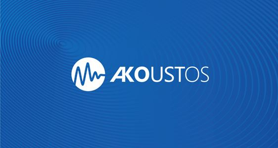

# Akoustos - Automated Bioacoustics Analysis Platform

## Project Description

With the goal of building an automated bioacoustics analysis platform, we hope it will:
1. enable us to help broader audience in acoustics community working on problems that can be solved by similar methods;
2. help conservation organizations and ecology practitioners to process audio recordings by detecting species presence more efficiently and more consistently with state-of-the-art machine learning techniques.

The near-term plan is to focus on automated sound detection and species classification tasks, using either binary, multi-class, or multi-label multi-class models. 

## Collaborators & Contributors
1. [Nowacek Acoustics and Engineering Lab](https://sites.nicholas.duke.edu/nowacek/) from Duke University
2. [Conservation X Lab](https://conservationxlabs.com/)
3. [Center for Conservation Bioacoustics](https://www.birds.cornell.edu/ccb/) from Cornell University
4. [Meridian](https://meridian.cs.dal.ca/)
5. [Rainforest Connection](https://www.rfcx.org/)
6. [AviaNZ](https://www.avianz.net/)
7. [ORCASOUND](https://www.orcasound.net/portfolio/bush-point-hydrophone/)
8. [Vulcan](https://vulcan.com/)
9. NOAA(https://www.noaa.gov/)

... and more

## Resources & Links
Relevant bioacoustics platforms & packages
1. [Ketos](https://docs.meridian.cs.dal.ca/ketos/)
2. [AviaNZ](https://www.avianz.net/index.php)
3. [Arbimon](https://arbimon.rfcx.org/)
4. [Raven](https://ravensoundsoftware.com/)
5. [Pamguard](https://www.pamguard.org/)
6. [EarthHz](https://data.songsofadaptation.org/)
7. [OpenSoundscape](http://opensoundscape.org/en/latest/)
8. [Ishmael](http://bioacoustics.us/ishmael.html)
9. [BTO Acoustic Pipeline](https://www.ctbto.org/specials/vdec/)

... and more

## Contributing

This project welcomes contributions and suggestions.  Most contributions require you to agree to a
Contributor License Agreement (CLA) declaring that you have the right to, and actually do, grant us
the rights to use your contribution. For details, visit https://cla.opensource.microsoft.com.

When you submit a pull request, a CLA bot will automatically determine whether you need to provide
a CLA and decorate the PR appropriately (e.g., status check, comment). Simply follow the instructions
provided by the bot. You will only need to do this once across all repos using our CLA.

This project has adopted the [Microsoft Open Source Code of Conduct](https://opensource.microsoft.com/codeofconduct/).
For more information see the [Code of Conduct FAQ](https://opensource.microsoft.com/codeofconduct/faq/) or
contact [opencode@microsoft.com](mailto:opencode@microsoft.com) with any additional questions or comments.

## Trademarks

This project may contain trademarks or logos for projects, products, or services. Authorized use of Microsoft 
trademarks or logos is subject to and must follow 
[Microsoft's Trademark & Brand Guidelines](https://www.microsoft.com/en-us/legal/intellectualproperty/trademarks/usage/general).
Use of Microsoft trademarks or logos in modified versions of this project must not cause confusion or imply Microsoft sponsorship.
Any use of third-party trademarks or logos are subject to those third-party's policies.
